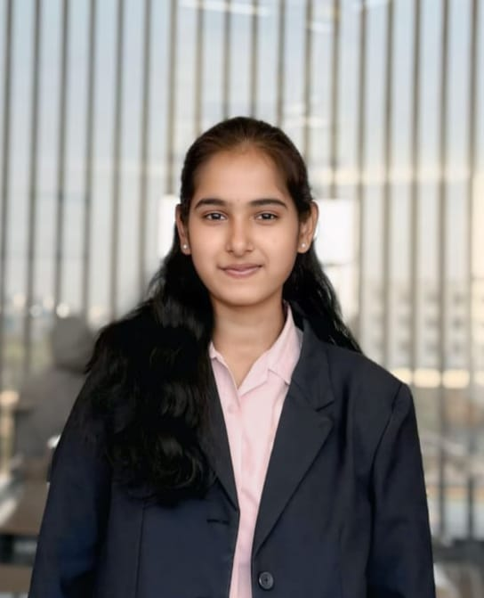

<!-- PROFILE IMAGE -->

  

<h1 align="center">Hi 👋, I'm Deepthi Aetukuri</h1>
<h3 align="center">🚀 Data Science | AI & GenAI Enthusiast</h3>

  

  

---

  

## 👩‍💻 About Me

🎓 **B.Tech – Computer Science (Data Science)**  
🏫 **MRECW, Telangana** | **CGPA: 9.30**

💡 Passionate about **Data Science, Artificial Intelligence & Generative AI**  
📊 Strong interest in **data analysis, intelligent systems, and real-world problem solving**

---

## 🔭 Currently Working On
- 🤖 Artificial Intelligence & Generative AI  
- 📊 Data Science & Analytics  
- 🧠 Machine Learning Models  

---

## 👯 Looking to Collaborate On
- 🐍 Python Projects  
- 🗄️ MySQL & Data Analysis  
- 📈 Power BI & Data Visualization  
- 🤖 Machine Learning  

---

## 🧩 Looking for Help With
- ✨ Advanced **Generative AI & LLM-based applications**

---

  

## 🏆 Certifications

✔ Oracle **Gen AI Certification**  
✔ Microsoft **Data Analytics Certification**  
✔ Coursera **Data Science Certification**  
✔ Cisco **Python & C Programming Essentials**  
✔ Pearson Certification  
✔ Codetantra **C Programming**

---

## 🧪 Projects

🔹 **Cotton Leaf Disease Detection using Neural Network**  
• Deep learning based image classification  
• Presented at **ICCNT Conference – IIT Indore**

🔹 **Online Voting Application using Blockchain**  
• Secure & tamper-proof digital voting system

🔹 **Image to Text Conversion (OCR)**  
• Extracted editable text from images

🔹 **Cloud Service Composition using Redfox Algorithm**  
• Optimized cloud workflows using dynamic orchestration

---

## 💼 Experience

🔸 **Microsoft Virtual Internship – Azure AI**  
📅 *May 2025 – June 2025*  
• Developed an **AI Medical Report Generator using X-ray images**  
• Worked with **Azure AI Services**

---

## 🛠️ Languages & Tools

  

📊 **Data & Analytics:** Power BI, KNIME, Pandas, Seaborn, Scikit-Learn  

---

## 📊 GitHub Stats

  
  

  

---

## 🌐 Connect With Me

  
  
  

---

## 🎯 Career Objective

💼 *To contribute to organizational growth by applying my skills in Data Science and AI, while continuously learning and evolving as a professional.*

---

  ✨ <b>“Data is powerful — insights change the world.”</b> ✨

